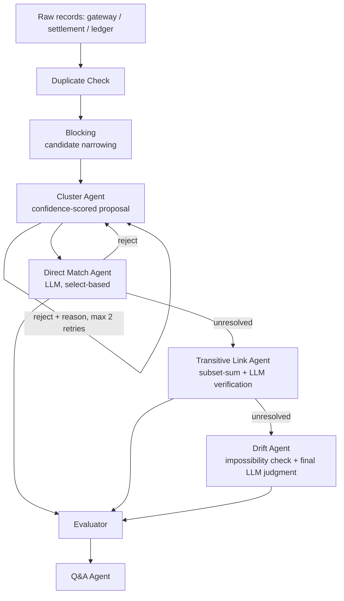

# Groupr — Multi-Source Reconciliation Agent

**Razorpay AI Buildathon — Track 4: AI Finance Controller**

An agent that reconciles payment gateway, bank settlement, and internal ledger
records — closing the finance-ops loop with measured accuracy and an honest
exception list, not a cherry-picked demo.

## Real results (150-transaction synthetic batch, 145 reconcilable clusters)

| Metric | Value |
|---|---|
| **Match rate** | **97.9%** (142/145) |
| **False positive rate** | **0.0%** (0/142 confirmed) |
| Honest exceptions | 3, each with a specific, verifiable reason |
| Duplicate detection | 10/10 caught, 0 false positives |

Every "confirmed" result is **independently re-verified against the raw
data in code** — never trusted purely on an LLM's claim. During development
the model hallucinated a false amount match twice; both times the
deterministic verification layer caught it before it reached the report.
That's not a footnote — it's the core design principle here.

## The problem

Given three independent, inconsistently-formatted records of the same
transaction — payment gateway, bank settlement, internal ledger — determine
which records belong together, flag what doesn't reconcile, and explain why.
Includes split/staged payments, batched settlements, duplicates, and
genuinely missing counterparts.

## Architecture



Every "confirm" from Direct Match and Drift passes a **deterministic
tolerance check in code** before being trusted — this is what makes 0%
false positives a real, earned number.

## Repository structure

```
├── config.py, narration.py       — shared constants + narration templates
├── graph.py                      — LangGraph wiring of all 5 agent stages
├── generator/
│   └── generate.py               — builds the synthetic dataset
├── agents/
│   ├── io_utils.py, env_setup.py — shared loaders
│   ├── dedup.py                  — duplicate detection
│   ├── blocking.py               — candidate narrowing
│   ├── cluster.py                — confidence-scored cluster proposals
│   ├── direct_match.py           — LLM select-based matching, reject-loop
│   ├── transitive_link.py        — split-payment subset-sum + LLM verify
│   └── drift.py                  — final resolver, impossibility check
├── evaluation/
│   ├── scorer.py                 — match rate / FP rate / exceptions
│   └── qa_agent.py               — Settlement Q&A agent
├── tests/                        — offline control-logic tests, one per agent
├── scripts/
│   └── run_pipeline.py           — the one live entry point (real Groq calls)
├── docs/
│   └── DEMO_SCRIPT.md            — shot-by-shot pitch video script
└── output/                       — generated dataset + pipeline results
```

Every module resolves its own imports from its file location, not from
whatever directory you happen to run it from — every command below works
regardless of your current working directory.

## How to run

```bash
pip install -r requirements.txt
cp .env.example .env        # add your Groq API key (free tier: console.groq.com)

python generator/generate.py           # build the synthetic dataset

python scripts/run_pipeline.py         # run the full pipeline (real Groq calls)

python evaluation/scorer.py            # score against ground truth
python evaluation/qa_agent.py "What's our match rate?"
```

For a quick check without the full batch:
```bash
python scripts/run_pipeline.py --limit 15
```

Offline tests (no API key needed) validate each agent's control logic:
```bash
python tests/test_dedup_blocking.py
python tests/test_cluster.py
python tests/test_direct_match.py
python tests/test_transitive_link.py
python tests/test_drift.py
python tests/test_graph.py
```

## Design choices worth knowing

- **Every cluster goes through the LLM step** — no rule-based shortcut skips
  a decision because it looks obvious. Cost control comes from batching API
  calls, not from skipping judgment.
- **Select-based LLM matching**, not pairwise comparison — the model picks
  from a shortlist rather than comparing every pair, per
  *Match, Compare, or Select?* (COLING 2025).
- **Two-tier tolerance**: loose for candidate search (so real matches never
  get silently dropped) and tight (±₹5 or 0.5%, whichever smaller) for the
  actual confirm decision — matching real-world reconciliation norms.
- **Honest exceptions over forced resolutions.** Two split-payment cases
  didn't resolve during testing — deliberately left as-is rather than
  prompt-tuned into resolving, because a system that resolves 100% on its
  own synthetic data looks over-tuned, not credible.

## Known limitations

- Gross-amount reconciliation only (no fee/tax netting).
- 3 sources (gateway, settlement, ledger) — invoices out of scope.
- Single currency (INR).
- Q&A agent supports 5 fixed question types by design, not open-domain.


